<div align="center">
  
</div>

---

# 🤖 PhantomX Pincher X100 — ROS 2 Humble · RViz

> **Resumen:** Práctica de laboratorio del curso *Robótica* orientada a la creación de Joint Controllers con ROS 2 para manipular servomotores Dynamixel AX-12 del robot **PhantomX Pincher X100**, incluyendo el desarrollo de una interfaz gráfica completa para control manual, movimiento por coordenadas cartesianas y visualización en RViz.

---

## 🎥 Video Demostrativo

<div align="center">

[](https://youtu.be/obf1X0HfMZE)

**Video completo mostrando todas las funcionalidades implementadas:**
- Movimiento Home y posición objetivo
- Control por terminal (Publisher)
- Suscriptor de estados articulares
- Visualización con Robotics Toolbox
- Interfaz gráfica completa (GUI)

</div>

---

## 🧾 Autores

- **Samuel David Sánchez Cárdenas**
  [](https://github.com/samsanchezcar)
- **Santiago Ávila Corredor**
  [](https://github.com/search?q=Santiago+Avila)

---

## 📥 Descargar e Instalar

### Clonar el Repositorio

```bash
# Opción 1: Clonar completo
git clone https://github.com/samsanchezcar/phantomx-pincher-ros2.git
cd phantomx-pincher-ros2

# Opción 2: Clonar solo el workspace de ROS 2
cd ~/ros2_ws/src
git clone https://github.com/samsanchezcar/phantomx-pincher-ros2.git phantom_ws
```

### Requisitos Previos

```bash
# ROS 2 Humble THIS IS JUST AN EXMPLE, Not the complet library and dependences donwload
sudo apt install ros-humble-desktop-full

# Dependencias Dynamixel
sudo apt install ros-humble-dynamixel-sdk

# Python dependencies
pip3 install pyqt5 roboticstoolbox-python spatialmath-python numpy
```

### Compilar el Workspace

```bash
cd ~/ros2_ws/phantom_ws
colcon build --symlink-install
source install/setup.bash
```

---

## 📂 Estructura del Repositorio

```text
phantomx-pincher-ros2/
├── DH.mlx                                    # Análisis cinemático en MATLAB
├── README.md                                 # Este archivo
├── ros2_ws/
│   └── phantom_ws/                           # Workspace principal de ROS 2
│       ├── src/                              # Paquetes fuente
│       │   ├── phantomx_pincher_description/ # 🎨 URDF, meshes y visualización
│       │   │   ├── urdf/
│       │   │   │   ├── phantomx_pincher.urdf           # Modelo unificado del robot
│       │   │   │   ├── phantomx_pincher.urdf.xacro     # Modelo parametrizable (macro)
│       │   │   │   ├── phantomx_pincher_arm.xacro      # Definición del brazo
│       │   │   │   ├── phantomx_pincher_hardware.xacro # Hardware interfaces
│       │   │   │   ├── phantomx_pincher_inertial.xacro # Parámetros inerciales
│       │   │   │   └── phantomx_pincher.ros2_control   # Control config
│       │   │   ├── meshes/                  # Archivos STL/DAE
│       │   │   │   ├── visual/              # Meshes para visualización
│       │   │   │   │   ├── ax12.dae         # Servo Dynamixel AX-12
│       │   │   │   │   ├── f2.dae           # Eslabón 2
│       │   │   │   │   ├── f3.dae           # Eslabón 3
│       │   │   │   │   ├── f4.dae           # Eslabón 4
│       │   │   │   │   └── gripper_base.dae # Base del gripper
│       │   │   │   └── collision/           # Meshes para colisiones
│       │   │   ├── launch/
│       │   │   │   ├── display.launch.py    # Lanzar RViz con el modelo
│       │   │   │   └── view.launch.py       # Vista simple del robot
│       │   │   └── rviz/
│       │   │       └── view.rviz            # Configuración RViz
│       │   │
│       │   ├── phantomx_pincher_bringup/    # 🚀 Launch files principales
│       │   │   ├── launch/
│       │   │   │   └── phantomx_pincher.launch.py  # Iniciar hardware real
│       │   │   └── config/
│       │   │       ├── controllers_position.yaml   # Control por posición
│       │   │       └── controllers_effort.yaml     # Control por esfuerzo
│       │   │
│       │   ├── phantomx_pincher_moveit_config/ # 🎯 Configuración MoveIt2
│       │   │   ├── config/
│       │   │   │   ├── kinematics.yaml      # Solver cinemático
│       │   │   │   ├── joint_limits.yaml    # Límites articulares
│       │   │   │   └── ompl_planning.yaml   # Planificador de trayectorias
│       │   │   ├── srdf/
│       │   │   │   └── phantomx_pincher.srdf # Descripción semántica
│       │   │   └── launch/
│       │   │       └── move_group.launch.py  # Nodo de planificación
│       │   │
│       │   ├── phantomx_pincher_interfaces/ # 📡 Mensajes y servicios custom
│       │   │   └── msg/
│       │   │       └── PoseCommand.msg      # Mensaje para comandos de pose
│       │   │
│       │   ├── phantomx_pincher_demos/      # 📚 Ejemplos de uso
│       │   │   └── examples/
│       │   │       ├── ex_joint_goal.py     # Movimiento a ángulos
│       │   │       ├── ex_pose_goal.py      # Movimiento a pose XYZ
│       │   │       └── ex_gripper.py        # Control del gripper
│       │   │
│       │   └── pincher_control/             # 🎛️ Controladores Python
│       │       └── pincher_control/
│       │           ├── control_servo.py          # GUI COMPLETA (principal)
│       │           ├── LAB5_P1.py                # Secuencia Home → Objetivo
│       │           ├── terminal_control.py       # Publisher por terminal
│       │           ├── terminal_subscriber.py    # Suscriptor /joint_states
│       │           └── toolbox.py                # Visualización Robotics Toolbox
│       │
│       ├── build/                           # Archivos compilados
│       ├── install/                         # Binarios instalados
│       └── log/                             # Logs de compilación
│
└── sources/                                 # Recursos multimedia
    ├── DH.png                               # Diagrama Denavit-Hartenberg
    ├── Matlab_vis.gif                       # Animación MATLAB
    ├── gui_main.png                         # Captura GUI: Panel principal
    ├── gui_manual_control.png               # Captura GUI: Control manual
    ├── gui_fix_value.png                    # Captura GUI: Valores fijos
    ├── gui_pose.png                         # Captura GUI: Ángulos predefinidos
    ├── gui_xyz_control.png                  # Captura GUI: Control XYZ
    ├── gui_visualization.png                # Captura GUI: Visualización
    └── gui_group.png                        # Captura GUI: Vista grupal
```

### 📘 Glosario de Archivos Clave

#### **URDF (Unified Robot Description Format)**
Formato XML para describir robots en ROS. Define:
- **Links**: Eslabones físicos del robot (geometría, inercia, colisión)
- **Joints**: Articulaciones que conectan los links (tipo, límites, ejes)
- **Sensors**: Cámaras, LIDAR, IMU, etc.

**Ejemplo**: `phantomx_pincher.urdf`

#### **XACRO (XML Macros)**
Extensión de URDF que permite:
- **Macros reutilizables**: Definir componentes una vez y usarlos múltiples veces
- **Parámetros**: Variables para dimensiones, colores, etc.
- **Includes**: Separar el robot en módulos (arm, gripper, base)

**Ejemplo**: `phantomx_pincher.urdf.xacro` → se compila a URDF

```xml
<!-- Ejemplo de macro XACRO -->
<xacro:macro name="dynamixel_ax12" params="name">
  <link name="${name}">
    <visual>
      <geometry>
        <mesh filename="package://phantomx_pincher_description/meshes/visual/ax12.dae"/>
      </geometry>
    </visual>
  </link>
</xacro:macro>
```

#### **Launch Files (.launch.py)**
Scripts Python que inician múltiples nodos ROS 2 con configuraciones específicas.

**Propósito**:
- Lanzar RViz con configuración específica
- Iniciar controladores de hardware
- Cargar parámetros desde YAML
- Configurar transformaciones (TF)

**Ejemplo**: `display.launch.py` inicia RViz + Robot State Publisher

#### **Meshes (STL/DAE)**
Modelos 3D del robot:
- **STL**: Para colisiones (simplificado)
- **DAE (COLLADA)**: Para visualización (detallado, con colores)

#### **RViz Configs (.rviz)**
Configuraciones guardadas de RViz:
- Paneles activos
- Displays habilitados (TF, RobotModel, LaserScan)
- Ángulos de cámara
- Temas de color

---

## 📋 Tabla de Contenidos

1. [Introducción](#introducción)  
2. [Objetivos](#objetivos)  
3. [Cinemática Directa - Parámetros DH](#cinemática-directa---parámetros-dh)  
4. [Movimiento Home y Posición Objetivo](#movimiento-home-y-posición-objetivo)  
5. [Control por Terminal - Publisher](#control-por-terminal---publisher)  
6. [Suscriptor de Estados Articulares](#suscriptor-de-estados-articulares)  
7. [Visualización con Robotics Toolbox](#visualización-con-robotics-toolbox)  
8. [Interfaz Gráfica de Usuario (GUI)](#interfaz-gráfica-de-usuario-gui)  
9. [Conclusiones](#conclusiones)  
10. [Referencias](#referencias)  

---

## 📖 Introducción

La integración de robots manipuladores con sistemas operativos robóticos (ROS) representa un pilar fundamental en la robótica moderna. Esta práctica se centra en el robot **PhantomX Pincher X100**, un manipulador de 4 grados de libertad equipado con servomotores **Dynamixel AX-12**, ampliamente utilizado en entornos académicos y de investigación.

El laboratorio abarca desde el análisis cinemático del manipulador hasta la implementación de una interfaz gráfica completa que permite:

- Control articular mediante sliders y valores numéricos.
- Movimiento en el espacio cartesiano (X, Y, Z) mediante cinemática inversa.
- Visualización en tiempo real con RViz y Robotics Toolbox.
- Comunicación bidireccional mediante tópicos y servicios de ROS 2.

La práctica integra conocimientos de cinemática, programación en Python, comunicación con hardware mediante el SDK de Dynamixel, y el ecosistema de ROS 2 Humble para crear un sistema de control robusto y modular.

---

## 🎯 Objetivos

- Crear todos los **Joint Controllers** con ROS para manipular servomotores **Dynamixel AX-12** del robot PhantomX Pincher.
- Manipular los **tópicos de estado y comando** para todos los Joint Controllers del robot PhantomX Pincher.
- Manipular los **servicios** para todos los Joint Controllers del robot PhantomX Pincher.
- Conectar el robot PhantomX Pincher con **Python** usando **ROS 2**.

---

## 📐 Cinemática Directa - Parámetros DH

El análisis cinemático del PhantomX Pincher X100 se realizó utilizando la convención de **Denavit-Hartenberg (DH)**. Este proceso involucró la identificación de los sistemas coordenados de cada articulación y el cálculo de los parámetros correspondientes.

### Ubicación de Ejes Coordenados

<div align="center">
  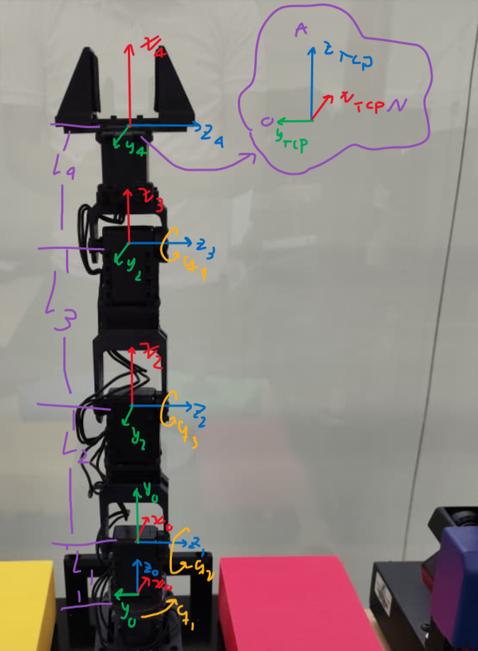
  <p><em>Asignación de sistemas coordenados según la convención Denavit-Hartenberg para el PhantomX Pincher.</em></p>
</div>

### Parámetros DH del Manipulador

| Articulación | θ (rad) | d (m) | a (m) | α (rad) |
|:------------:|:-------:|:-----:|:-----:|:-------:|
| 1 | q₁ | 0.044 | 0 | π/2 |
| 2 | q₂ + π/2 | 0 | 0.1075 | 0 |
| 3 | q₃ | 0 | 0.1075 | 0 |
| 4 | q₄ | 0 | 0.0753 | 0 |

### Implementación en MATLAB

El archivo `DH.mlx` contiene la implementación del modelo cinemático directo utilizando el Robotics Toolbox de Peter Corke para MATLAB. Esta implementación permite:

- Calcular la posición y orientación del efector final dado un conjunto de ángulos articulares.
- Visualizar el robot en diferentes configuraciones.
- Validar los parámetros DH obtenidos analíticamente.

<div align="center">
  
  <p><em>Visualización del modelo cinemático en MATLAB usando el Robotics Toolbox.</em></p>
</div>

---

## 🏠 Movimiento Home y Posición Objetivo

El script `LAB5_P1.py` implementa una secuencia de movimientos que lleva el robot desde la posición **Home** (todos los ángulos en 0°) hasta una configuración objetivo definida, moviendo cada articulación de forma secuencial.

### Descripción Funcional

El nodo `SecuenciaLab5` utiliza el controlador de motores `PincherController` para:

1. Inicializar la comunicación con los servomotores.
2. Llevar el robot a la posición Home.
3. Calcular las posiciones objetivo en valores Dynamixel.
4. Mover secuencialmente cada articulación (waist → shoulder → elbow → wrist).

**Ubicación del archivo:** `ros2_ws/phantom_ws/src/pincher_control/pincher_control/LAB5_P1.py`

### Ejecución

```bash
# Terminal 1: Lanzar nodo de control
ros2 run pincher_control L5_P1

# El robot se moverá automáticamente a Home y luego a la posición objetivo
```

### Diagrama de Flujo

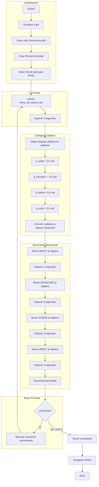

---

## ⌨️ Control por Terminal - Publisher

El script `terminal_control.py` permite controlar el robot PhantomX Pincher desde la línea de comandos, publicando posiciones articulares directamente a los motores.

### Descripción Funcional

Este nodo ofrece dos modos de operación:

1. **Control Individual:** Especificar un motor y su ángulo objetivo en grados.
2. **Configuraciones Predefinidas:** Seleccionar entre 5 poses preconfiguradas (c1-c5).

**Ubicación del archivo:** `ros2_ws/phantom_ws/src/pincher_control/pincher_control/terminal_control.py`

### Configuraciones Predefinidas

| Config | Waist | Shoulder | Elbow | Wrist | Gripper | Descripción |
|:------:|:-----:|:--------:|:-----:|:-----:|:-------:|:-----------:|
| c1 | 0° | 0° | 0° | 0° | 0° | HOME |
| c2 | 25° | 25° | 20° | -20° | 0° | Alcance Medio |
| c3 | -35° | 35° | -30° | 30° | 0° | Lateral |
| c4 | 85° | -20° | 55° | 25° | 0° | Elevada |
| c5 | 80° | -35° | 55° | -45° | 0° | Extendida |

### Ejecución

```bash
# Lanzar controlador por terminal
ros2 run pincher_control terminal_control

# Comandos disponibles:
# <motor_id> <ángulo>  → Ejemplo: 1 45
# c1, c2, c3, c4, c5   → Configuraciones predefinidas
# help                 → Mostrar ayuda
# quit                 → Salir
```

### Diagrama de Flujo

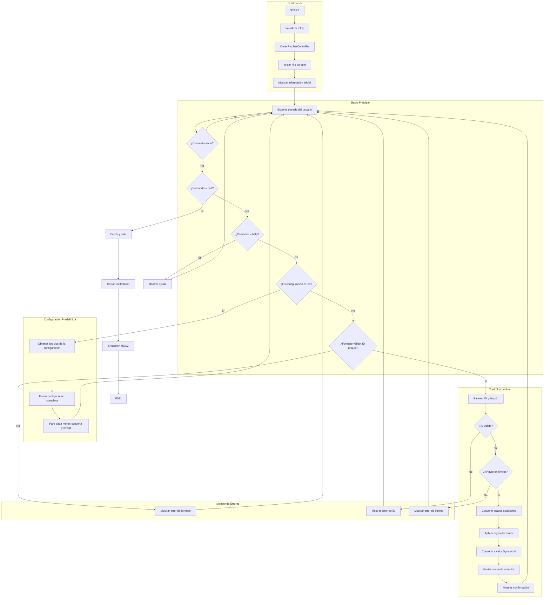

---

## 👁️ Suscriptor de Estados Articulares

El script `terminal_subscriber.py` implementa un nodo suscriptor que muestra en tiempo real los estados de las articulaciones del robot.

### Descripción Funcional

Este nodo se suscribe al tópico `/joint_states` y convierte las posiciones de radianes a grados para una visualización más intuitiva.

**Ubicación del archivo:** `ros2_ws/phantom_ws/src/pincher_control/pincher_control/terminal_subscriber.py`

### Ejecución

```bash
# Terminal 1: Lanzar cualquier controlador
ros2 run pincher_control terminal_control

# Terminal 2: Monitorear estados
ros2 run pincher_control terminal_sub

# Salida ejemplo:
# Estados actuales:
#   waist: 45.2°
#   shoulder: -12.8°
#   elbow: 30.1°
#   wrist: 15.6°
#   gripper: 0.0°
```

### Diagrama de Flujo

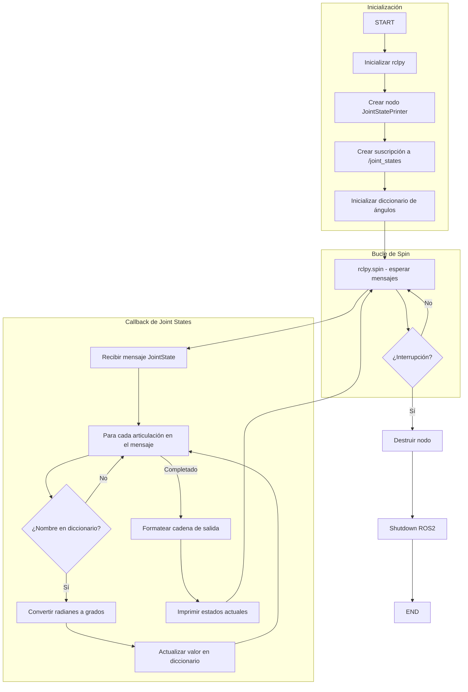


---

## 🔧 Visualización con Robotics Toolbox

El script `toolbox.py` proporciona una visualización 3D en tiempo real del robot utilizando el **Robotics Toolbox de Peter Corke** para Python.

### Descripción Funcional

Este nodo combina ROS 2 con matplotlib para mostrar el modelo cinemático del robot actualizándose en tiempo real según los datos del tópico `/joint_states`.

**Ubicación del archivo:** `ros2_ws/phantom_ws/src/pincher_control/pincher_control/toolbox.py`

### Ejecución

```bash
# Lanzar visualización Toolbox
ros2 run pincher_control toolbox

# Se abrirá una ventana matplotlib mostrando el robot en 3D
# El modelo se actualiza automáticamente conforme el robot se mueve
```

### Diagrama de Flujo

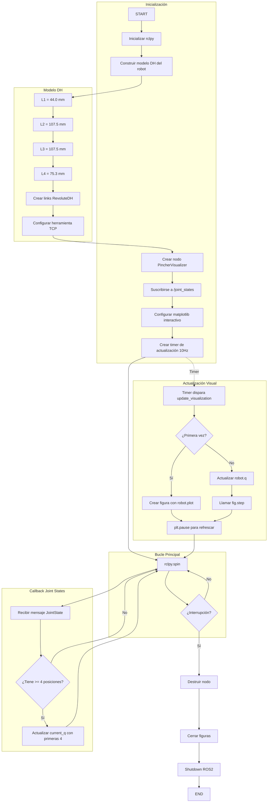


---

## 🖥️ Interfaz Gráfica de Usuario (GUI)

El script `control_servo.py` implementa una interfaz gráfica completa utilizando **PyQt5** que integra todas las funcionalidades de control del robot.

### Descripción Funcional

La GUI ofrece **7 páginas especializadas** de control:

<div align="center">
  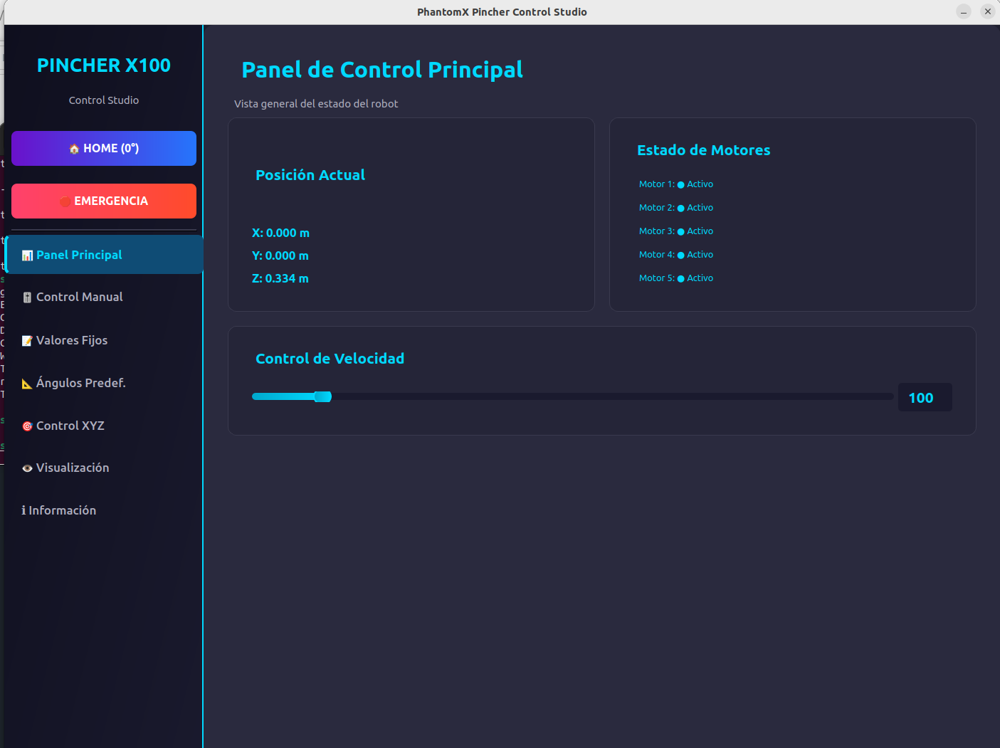
  <p><em><strong>1. Panel Principal:</strong> Vista general del estado del robot y control de velocidad.</em></p>
</div>

<div align="center">
  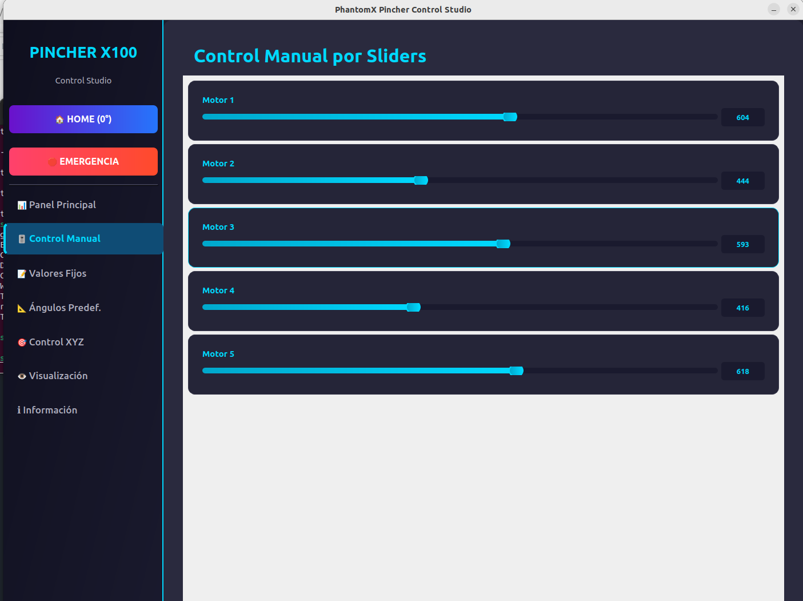
  <p><em><strong>2. Control Manual:</strong> Sliders para control continuo de cada articulación.</em></p>
</div>

<div align="center">
  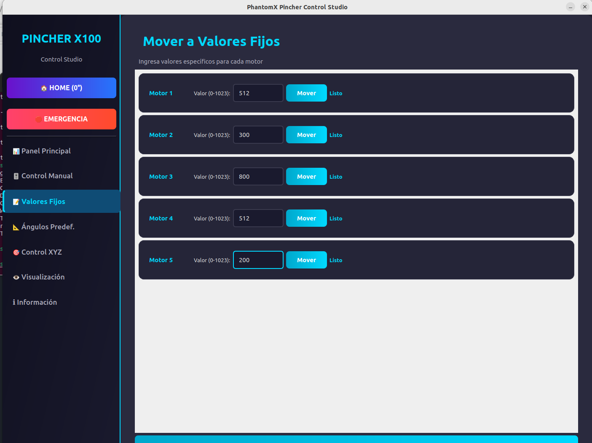
  <p><em><strong>3. Valores Fijos:</strong> Entrada numérica directa para cada motor (0-1023).</em></p>
</div>

<div align="center">
  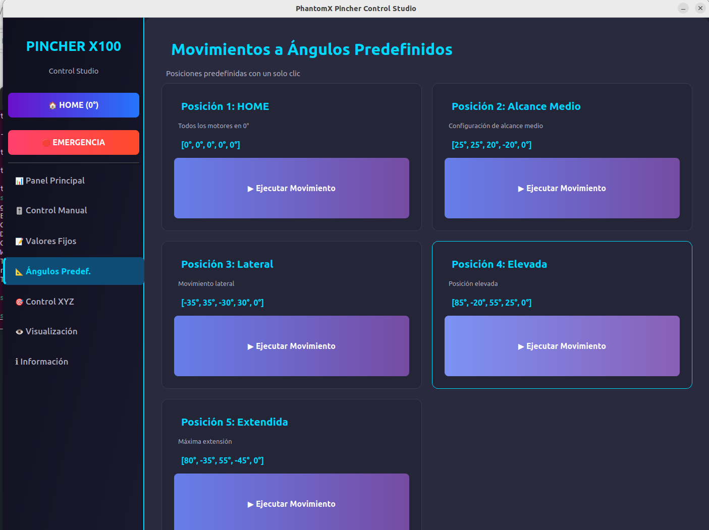
  <p><em><strong>4. Ángulos Predefinidos:</strong> 5 poses preconfiguradas con un clic.</em></p>
</div>

<div align="center">
  
  <p><em><strong>5. Control XYZ:</strong> Movimiento en coordenadas cartesianas con cinemática inversa.</em></p>
</div>

<div align="center">
  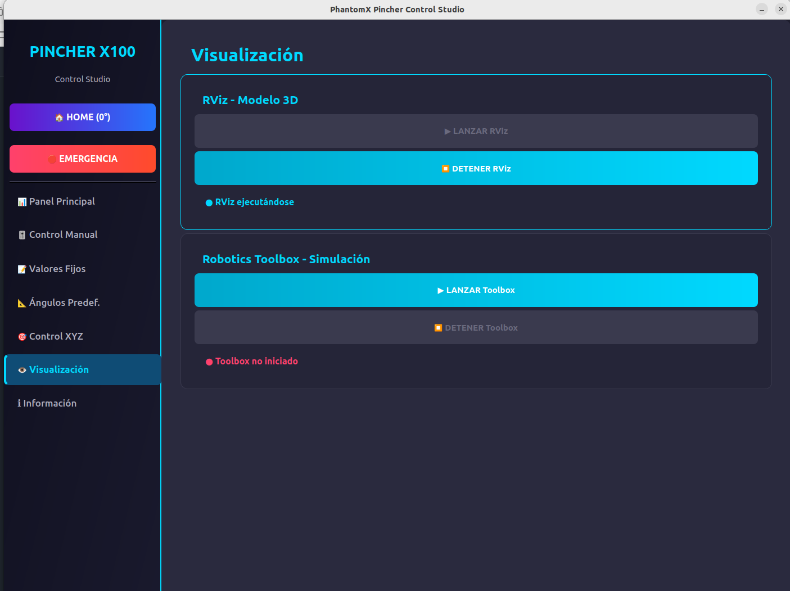
  <p><em><strong>6. Visualización:</strong> Lanzadores para RViz y Robotics Toolbox.</em></p>
</div>

<div align="center">
  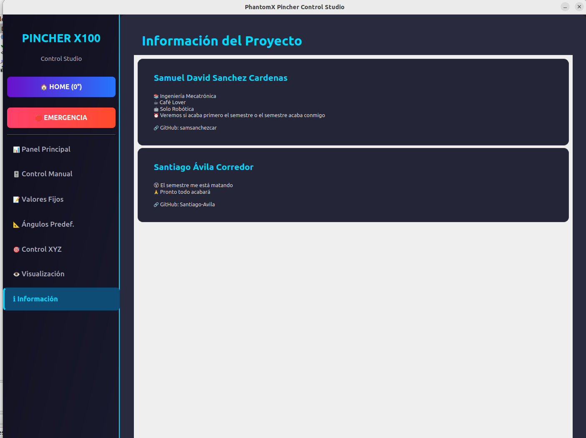
  <p><em><strong>Vista completa de la interfaz moderna con menú lateral.</strong></em></p>
</div>

**Ubicación del archivo:** `ros2_ws/phantom_ws/src/pincher_control/pincher_control/control_servo.py`

### Características Principales

#### **Panel Principal (Dashboard)**
- ✅ Posición cartesiana actual (X, Y, Z)
- ✅ Estado de motores en tiempo real
- ✅ Control de velocidad global
- ✅ Botón HOME rápido
- ✅ Parada de emergencia

#### **Control Manual**
- ✅ Sliders independientes para cada motor
- ✅ Valores en tiempo real (0-1023 o 0-4095)
- ✅ Control suave y continuo

#### **Valores Fijos**
- ✅ Entrada numérica precisa
- ✅ Mover motores individuales
- ✅ Comando global "Mover Todos"

#### **Ángulos Predefinidos**
- ✅ 5 poses pre-programadas
- ✅ Descripción de cada posición
- ✅ Ejecución con un solo clic

#### **Control XYZ**
- ✅ Cinemática inversa con **ikine_LM** (Levenberg-Marquardt)
- ✅ Validación de alcance en tiempo real
- ✅ 4 posiciones rápidas predefinidas
- ✅ Feedback visual del estado de IK

#### **Visualización**
- ✅ Lanzar RViz desde la GUI
- ✅ Lanzar Robotics Toolbox desde la GUI
- ✅ Control de procesos (iniciar/detener)

#### **Información**
- ✅ Datos del proyecto
- ✅ Información de autores
- ✅ Enlaces a GitHub

### Ejecución

```bash
# Lanzar GUI completa
ros2 run pincher_control control_servo

# La interfaz se abrirá automáticamente
# Todas las funciones están integradas en un solo programa
```

### Tema Visual Moderno

La GUI utiliza un diseño **oscuro profesional** con:
- 🎨 Gradientes cyan-azul (#00d9ff)
- 🎨 Fondos oscuros (#1e1e2e)
- 🎨 Cards con hover effects
- 🎨 Tipografía Segoe UI / Ubuntu
- 🎨 Íconos Unicode integrados

### Diagrama de Flujo - Sistema Principal

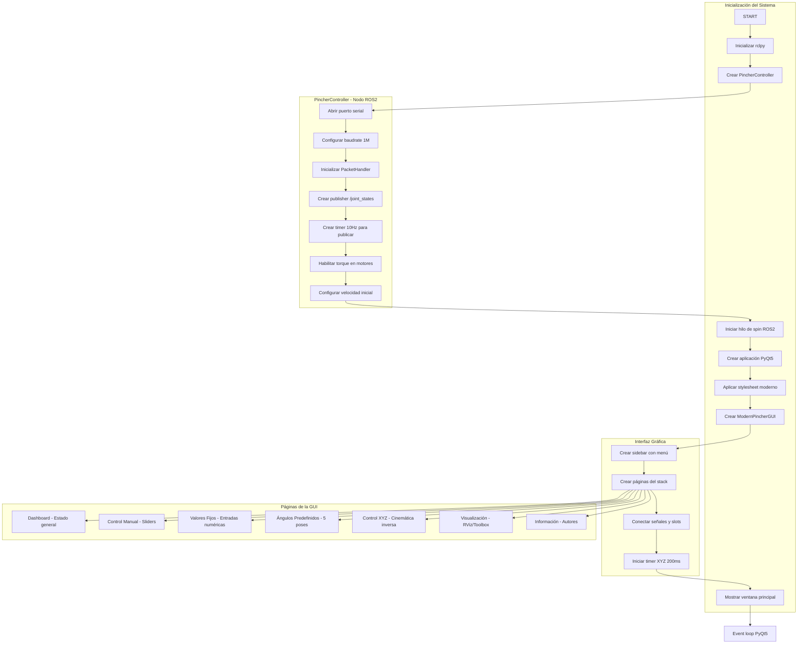

### Diagrama de Flujo - Control XYZ (Cinemática Inversa)

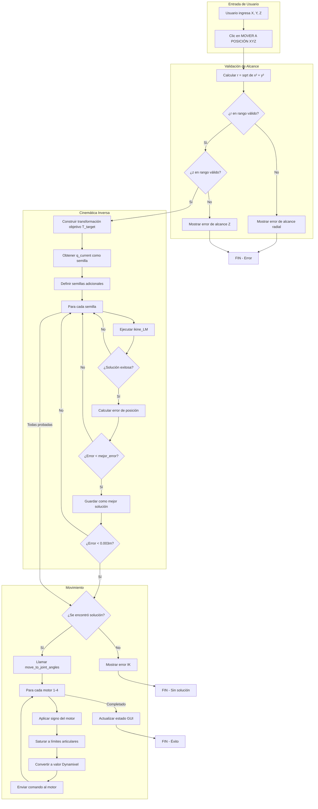

---

## 🎓 Conclusiones

1. **Integración ROS 2 - Hardware:** La comunicación exitosa entre ROS 2 Humble y los servomotores Dynamixel AX-12 mediante el SDK de Dynamixel demuestra la viabilidad de crear sistemas de control robótico modulares y escalables.

2. **Arquitectura Pub/Sub:** El patrón publicador-suscriptor de ROS 2 facilitó la separación de responsabilidades entre el control de motores (`PincherController`), la visualización (`toolbox.py`, RViz) y la interfaz de usuario (GUI), permitiendo que cada componente opere de forma independiente.

3. **Cinemática Inversa:** La implementación del algoritmo `ikine_LM` (Levenberg-Marquardt) permitió alcanzar posiciones cartesianas dentro del espacio de trabajo alcanzable con alta precisión y robustez ante singularidades.

4. **Interfaz de Usuario:** El desarrollo de una GUI moderna con PyQt5 demostró que es posible crear herramientas de control intuitivas que abstraen la complejidad del sistema ROS 2 subyacente, facilitando la operación por usuarios no expertos.

5. **Visualización en Tiempo Real:** La integración con RViz y el Robotics Toolbox de Peter Corke proporcionó retroalimentación visual inmediata del estado del robot, crucial para la validación de movimientos y la detección de errores de configuración.

6. **Modularidad del Código:** La estructura del paquete `pincher_control` con scripts independientes para cada funcionalidad (terminal_control, terminal_subscriber, toolbox, control_servo) facilita el mantenimiento, pruebas y extensión futura del sistema.

7. **Parámetros DH:** La correcta identificación de los parámetros Denavit-Hartenberg y su implementación tanto en MATLAB como en Python fue fundamental para la coherencia entre el modelo simulado y el robot físico.

8. **URDF y XACRO:** El uso de archivos XACRO parametrizables permitió mantener un modelo del robot modular y fácil de actualizar, mientras que los meshes en formato DAE mejoraron significativamente la calidad visual en RViz.

---

## 📚 Referencias

1. **Laboratorio No. 05 - Pincher Phantom X100 - ROS Humble - RViz.** Universidad Nacional de Colombia, 2025.

2. ROBOTIS. *DYNAMIXEL SDK Manual.* Documentación oficial para comunicación con servomotores Dynamixel.  
   https://emanual.robotis.com/docs/en/software/dynamixel/dynamixel_sdk/

3. ROBOTIS. *DYNAMIXEL Workbench - ROS Tutorials.* Guías oficiales para integración con ROS.  
   https://emanual.robotis.com/docs/en/software/dynamixel/dynamixel_workbench/#ros-tutorials

4. Corke, P. *Robotics, Vision and Control: Fundamental Algorithms in MATLAB.* Springer, 2017.

5. Corke, P. *Robotics Toolbox for Python.* GitHub Repository.  
   https://github.com/petercorke/robotics-toolbox-python

6. Open Robotics. *ROS 2 Humble Documentation.*  
   https://docs.ros.org/en/humble/

7. Open Robotics. *URDF - Unified Robot Description Format.*  
   http://wiki.ros.org/urdf

8. Trossen Robotics. *PhantomX Pincher Robot Arm Assembly Guide.*

9. Qt Company. *PyQt5 Documentation.*  
   https://www.riverbankcomputing.com/static/Docs/PyQt5/

10. Craig, J.J. *Introduction to Robotics: Mechanics and Control.* Pearson, 3rd Edition, 2005.

---

## 🛠️ Tecnologías Utilizadas

<div align="center">


</div>

---

## 📄 Licencia

Este proyecto está bajo la Licencia MIT. Ver el archivo `LICENSE` para más detalles.

---

## 🤝 Contribuciones

Las contribuciones son bienvenidas. Por favor:

1. Fork el proyecto
2. Crea una rama para tu feature (`git checkout -b feature/AmazingFeature`)
3. Commit tus cambios (`git commit -m 'Add: AmazingFeature'`)
4. Push a la rama (`git push origin feature/AmazingFeature`)
5. Abre un Pull Request

---

## 📧 Contacto

**Samuel David Sánchez Cárdenas**  
📧 Email: [samsanchezcar@gmail.com](samsanchezcar@gmail.com)
🔗 GitHub: [@samsanchezcar](https://github.com/samsanchezcar)

**Santiago Ávila Corredor**  
📧 Email: savilac@unal.edu.co  
🔗 GitHub: Buscar "Santiago Avila"

---

<div align="center">
  
</div>
